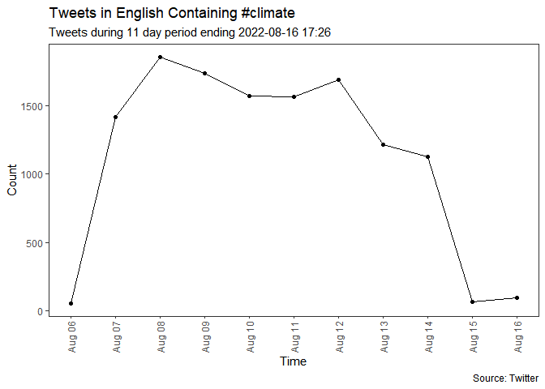
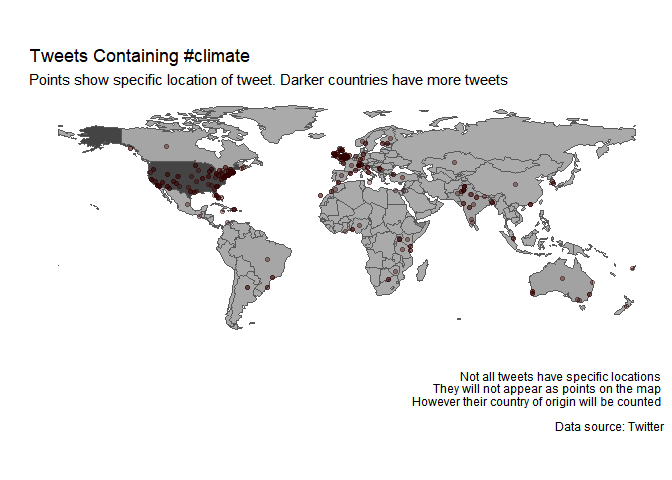
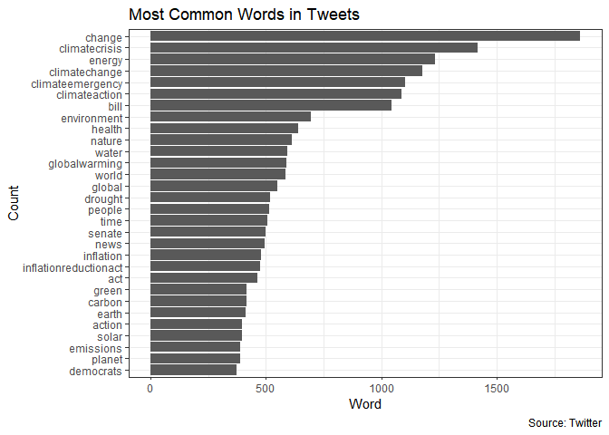
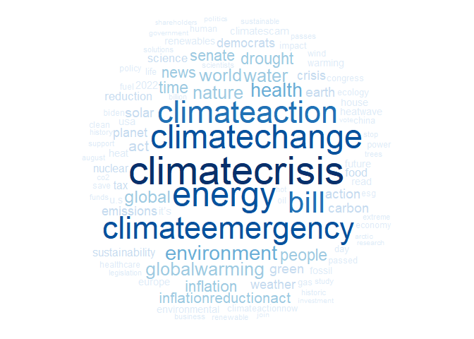
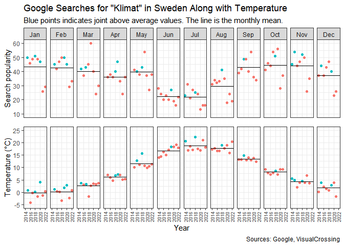

Temperature, Emissions and People’s Tweets
================
Timothy Rafael Lindblom
2022-08-21

This project aims to visualize some data surrounding the climate, and
the surrounding discussion. To achieve the task, I will use data from
Our World in Data, Twitter, PositionStack, Iban, Google, and
VisualCrossing.

``` r
library(tidyverse)
library(httr)
library(lubridate)
library(rtweet)
library(jsonlite)
library(tidytext)
library(SnowballC)
library(tm)
library(ggrepel)
library(rvest)
library(utils)
library(wordcloud)
library(RColorBrewer)
library(ggpubr)
```

# Emissions and the Future

The emissions data is from [Our World in
Data](https://github.com/owid/co2-data). The data contains quite a few
variables however I will be looking closer at CO2 emissions.

``` r
co2_data <- read_csv("data/owid-co2-data.csv")

continents <- c("North America", "Europe", "Asia", "South America", "Africa", "Oceania")

continent_data <- co2_data %>%
  filter(country %in% continents)
```

Illustrating each continents share of global CO2 emissions over time.

``` r
continent_data %>%
  mutate(cent = as.factor(if_else(year %% 100 == 0, 1, 0))) %>%
  ggplot(aes(year,
             share_global_co2 / 100,
             label = if_else(cent == 1, paste0(signif(share_global_co2, digits = 3), " %"),'')
             )) +
  geom_line() +
  geom_point(aes(color = cent), size = 2) +
  scale_color_manual(values = c("#ffffff00", "#000000"), guide = "none") +
  facet_wrap(vars(factor(country, levels = continents))) +
  geom_label_repel(box.padding   = 0.35, 
                  point.padding = 0.5,
                  max.overlaps = 200,
                  size = 2.5) +
  theme_bw() + labs(x = "Year", y = "Percentage", title = "Share of Global CO2 Emissions by Continent", subtitle = "Years 1750-2022", caption = "Data: Our World in Data") + scale_y_continuous(label = scales::label_percent())
```

<!-- -->

# Twitter Discussion

Moreover, I think its interesting to find out what people write about
the climate on Twitter. Therefore, I will use their API and illustrate
the frequency, the location and the textual data for the last 11 days
(from the API call).

The tweets retrieved are those in English, containing \#climate, not
including retweets.

``` r
#tweets <- search_tweets(q = "#climate",
#                        n = 100000,
#                        include_rts = FALSE,
#                        lang = "en") # Called 2022-08-16 17:26
#write_json(tweets, path = "data\climate_tweets.json")

tweets <- as.data.frame(read_json("data/climate_tweets.json", simplifyVector = T))

tweetsts <- ts_data(tweets)
tweetsts %>%
  ggplot(aes(time, n)) +
  geom_line() +
  geom_point() +
  theme_bw() + 
  scale_x_datetime(date_breaks = "1 day", date_labels = "%b %d", ) +
  labs(x = "Time",
       y = "Count",
       title = "Tweets in English Containing #climate",
       subtitle = "Tweets during 11 day period ending 2022-08-16 17:26",
       caption = "Source: Twitter") +
  theme(axis.text.x = element_text(angle = 90, vjust = 0.5, hjust = 1),
        panel.grid = element_blank())
```

<!-- -->

``` r
places <- as.data.frame(unlist(tweets$place))
places <- places %>%
  transmute(loc = `unlist(tweets$place)`)

most_common_locations <- places %>% 
  filter(!is.na(loc)) %>%
  filter(str_starts(loc, "[:upper:]")) %>%
  filter(loc != "Polygon") %>% # For some reason, crypto enthusiasts are saying Polygon is their location
  group_by(loc) %>%
  summarise(n = n()) %>%
  arrange(desc(n))

most_common_locations
```

    ## # A tibble: 363 × 2
    ##    loc                  n
    ##    <chr>            <int>
    ##  1 United States      103
    ##  2 US                  97
    ##  3 GB                  50
    ##  4 United Kingdom      50
    ##  5 IE                  15
    ##  6 India               15
    ##  7 Ireland             15
    ##  8 IN                  11
    ##  9 Wexford             11
    ## 10 Wexford, Ireland    11
    ## # … with 353 more rows

To find the coordinates of each location, I will use [Forward
Geocoding](https://positionstack.com) from PositionStack. The API
requires URL encoded queries, therefore I will make use of `URLencode`
from the `utils` package. Moreover, PositionStack does not accept
queries shorter than 3 chars. Therefore we need to separate 2 char codes
from the data.

Quick HTML scraping so that we can combine Alpha-3 and Alpha-2 datasets.
(Example, AFG = AF. The codes stand for Afghanistan)

``` r
read_iso_3166_1 <- function() {
  codes <- read_html("https://www.iban.com/country-codes") %>% 
  html_node("table") %>% 
  html_table() %>%
  rename(code_two = `Alpha-2 code`, code_three = `Alpha-3 code`)
  return(codes)
}

country_codes <- read_iso_3166_1()
```

Finding out which two char codes are country codes

``` r
two_char_countries <- inner_join(most_common_locations, country_codes, copy = T, by = c("loc" = "code_two"))
two_char <- filter(most_common_locations, str_length(loc) == 2)
anti_join(two_char, two_char_countries) # All two char codes are country codes
```

    ## # A tibble: 0 × 2
    ## # … with 2 variables: loc <chr>, n <int>

Extract non two char codes from most_common_locations

``` r
api_locations <- anti_join(most_common_locations, two_char, copy = T)
```

Fetching geolocations using PositionStack.

``` r
#get_coordinates_by_address <- function(address) {
#  data <- GET(paste0("http://api.positionstack.com/v1/forward?access_key=[api_key]&query=", URLencode(address), "&limit=1&output=json")) 
#  data <- as.data.frame(fromJSON(rawToChar(data$content), flatten = TRUE))
#  return(data)
#}

#tweet_coords <- map_df(api_locations$loc, get_coordinates_by_address)
#write_csv(tweet_coords, "data/tweet_coords.csv")

tweet_coords <- read_csv("data/tweet_coords.csv")
```

Tweet locations

``` r
world_map <- rnaturalearth::ne_countries(returnclass = "sf")

# Remove Antarctica
world_map <- world_map %>%
  filter(sovereignt != "Antarctica")

tweet_occurances <- two_char_countries %>%
  select(-n) %>%
  full_join(tweet_coords, by = c("code_three" = "data.country_code")) %>%
  full_join(world_map, by = c("code_three" = "iso_a3")) %>%
  select(code_three, data.longitude, data.latitude, name_long, income_grp, geometry, pop_est)

count_country <- tweet_occurances %>%
  drop_na(code_three) %>%
  group_by(code_three) %>%
  summarize(n = n())

tweet_occurances <- left_join(tweet_occurances, count_country)

ggplot(tweet_occurances) +
  geom_sf(aes(fill = n, geometry = geometry)) +
  geom_point(aes(x = data.longitude, y = data.latitude), alpha = 0.35, color = "#310000") +
  theme(plot.background = element_blank(),
        axis.ticks = element_blank(),
        panel.background = element_blank(),
        axis.line = element_blank(),
        axis.text = element_blank(),
        panel.grid = element_blank()
        ) +
  scale_fill_gradient(low = "#AAAAAA", high = "#444444", guide = "none") + 
  labs(x = "", y = "", title = "Tweets Containing #climate", subtitle = "Points show specific location of tweet. Darker countries have more tweets", caption = "Not all tweets have specific locations \n They will not appear as points on the map \n However their country of origin will be counted \n\n Data source: Twitter")
```

<!-- -->

<br/> Now lets look at what people tweet about when they include
\#climate. We will start by splitting the tweet into individual words
along with removing symbols.

``` r
tok <- tweets %>% 
  unnest_tokens(word, text)

top_words <- tok %>% 
  anti_join(stop_words) %>% # Removes stopwords from tokens
  count(word) %>% 
  slice_max(n, n=10)

top_words
```

    ##                word     n
    ## 1           climate 14606
    ## 2              t.co 13040
    ## 3             https 13025
    ## 4            change  1862
    ## 5               amp  1821
    ## 6     climatecrisis  1418
    ## 7            energy  1234
    ## 8     climatechange  1177
    ## 9  climateemergency  1104
    ## 10    climateaction  1089

<br/> When looking at these words, we see that some are nonsensical.
Therefore, we will add them to the stop_words list.

``` r
custom_stopwords <- add_row(stop_words, word="t.co", lexicon="custom")
custom_stopwords <- add_row(custom_stopwords, word="https", lexicon="custom")
custom_stopwords <- add_row(custom_stopwords, word="it's", lexicon="custom")
custom_stopwords <- add_row(custom_stopwords, word="amp", lexicon="custom")

top_words <- tok %>% 
  anti_join(custom_stopwords) %>% # Removes stopwords from tokens
  count(word) %>% 
  slice_max(n, n=31) %>%
  slice_min(n, n=30)

# Lets plot these words
top_words %>% 
  ggplot(aes(n, reorder(word, n))) +
  geom_col() +
  labs(x = "Word", y = "Count", title = "Most Common Words in Tweets", caption = "Source: Twitter") +
  theme_bw()
```

<!-- -->

Many of these words seem to be hashtags such as climatecrisis or
inflationreductionact. Let’s look at a competing visualisation of the
words, namely a wordcloud. The wordcloud also allows us to include more
data points, although it is questionable whether it adds any extra
information.

``` r
top_words <- tok %>% 
  anti_join(custom_stopwords) %>% # Removes stopwords from tokens
  count(word) %>% 
  filter(nchar(word) > 2) %>%
  slice_max(n, n = 101) %>%
  slice_min(n, n = 100) 

wordcloud(words = top_words$word,
          freq = top_words$n,
          min.freq = 50,
          max.words = 100,
          random.order = F,
          rot.per = 0,
          colors = brewer.pal(9, "Blues"),
          scale=c(3.5, 0.25),
          use.r.layout = F)
```

<!-- -->

# Google Trends and Temperature

The temperature data is from
[VisualCrossing](https://www.visualcrossing.com/weather-data) where you
can select a location. In this case I retrieved the data for Stockholm.

The trend data was manually selected from the [Google
Trends](https://trends.google.com/trends/explore?date=all&q=Climate).
The data is for Google searches of the keyword in Sweden.

``` r
timestamp <- c("2014-06-03_to_2015-12-31",
"2016-01-01_to_2018-09-26",
"2018-09-27_to_2021-06-22",
"2021-06-23_to_2022-08-19")

temperature_data_combined <- function(timestamp) {
  temperature_data <- read_csv(paste0("data/temperature/stockholm_", timestamp, ".csv"))
  return(temperature_data)
}

temp_data <- map_df(timestamp, temperature_data_combined)

temp_data <- temp_data %>%
  mutate(datetime = as_datetime(datetime)) %>%
  mutate(month = months(datetime)) %>%
  mutate(year = format(datetime, "%Y"))

temp_search <- read_csv("data/google_trends/klimat_sweden.csv", skip = 2)

temp_data <- temp_data %>%
  mutate(month = str_pad(match(month, month.name), pad = "0", width = 2)) %>%
  group_by(month, year) %>%
  summarise(avg_temp = mean(temp)) %>%
  unite(col = "Månad", c(year, month), sep = "-", remove = F) %>%
  left_join(temp_search) %>%
  rename(search_climate = `klimat: (Sverige)`)

monthly_avg <- temp_data %>%
  group_by(month) %>%
  summarize(avg_monthly_temp = mean(avg_temp), avg_search_climate = mean(search_climate))
```

Check whether both data points are above or below the monthly average

``` r
filter_func <- function(i) {
  a <- str_pad(i, width = 2, side = "left", pad = "0")
  temp_data %>%
    filter(month == a) %>%
    transmute(and_temp = (avg_temp > monthly_avg$avg_monthly_temp[as.numeric(a)] & search_climate > monthly_avg$avg_search_climate[as.numeric(a)])) %>%
    return()
}

i <- 1:12

both_points <- map_df(i, filter_func) %>%
  rename(t_f = month)
```

Combine data and visualize

``` r
temp_data <- temp_data %>%
  add_column(both_points)

facet_names <- temp_data %>%
  group_by(month) %>%
  transmute(month_name = str_sub(as.character(months(ym(Månad))), 1, 3)) %>%
  distinct(month_name)
  
facet_names <- setNames(facet_names$month_name, facet_names$month)

a <- temp_data %>%
  ggplot() +
  geom_point(aes(x = year, y = search_climate, color = and_temp)) +
  geom_hline(data = monthly_avg, aes(yintercept = avg_search_climate)) +
  scale_color_discrete(guide = "none") +
  scale_x_discrete(breaks = seq(2014, 2022, by = 2)) + 
  scale_y_continuous(breaks = seq(10, 60, by = 10), limits = c(10, 60)) + 
  facet_wrap(vars(month), nrow = 1, labeller = as_labeller(facet_names)) +
  theme_bw() + 
  theme(axis.text.x = element_blank(), 
        axis.title.x = element_blank(),
        axis.line.x = element_blank(),
        axis.ticks.x = element_blank()
        ) +
  labs(y = "Search popularity", title = "Google Searches for \"Klimat\" in Sweden Along with Temperature", subtitle = "Blue points indicates joint above average values. The line is the monthly mean.")

b <- temp_data %>%
  ggplot() +
  geom_point(aes(x = year, y = avg_temp, color = and_temp)) +
  geom_hline(data = monthly_avg, aes(yintercept = avg_monthly_temp)) +
  scale_color_discrete(guide = "none") +
  facet_wrap(vars(month), nrow = 1) +
  theme_bw() + 
  theme(axis.text.x = element_text(angle = 90, vjust = 0.5, hjust = 1, size = 7),
        strip.background = element_blank(),
        strip.text = element_blank()) +
  scale_y_continuous(breaks = seq(-5, 25, by = 5), limits = c(-5, 25)) + 
  scale_x_discrete(breaks = seq(2014, 2022, by = 2)) + 
  labs(x = "Year", y = "Temperature (°C)", caption = "Sources: Google, VisualCrossing")

ggarrange(a, b, nrow = 2)
```

<!-- -->

We can see that in the last two years, it has been less popular to
search for climate. We also see that fewer searches are made during the
summer, ironically the warmest months of the year.

Beforehand seeing the data, my belief was that extreme temperatures
would lead to more searches of climate. This visualization seems to
contradict that hypothesis.

To be honest, my hypothesis is better tested with daily data, however
Google Trends did not offer that so I had no choice but to use monthly
data.
